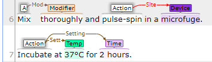

# Wet Lab Protocols

This repository contains the Conditional Random Fields (CRF) model for the shared task [ Entity and relation recognition over wet-lab protocols](http://noisy-text.github.io/2020/wlp-task.html).
This shared task was part of the [6th Workshop on Noisy User-generated Text](http://noisy-text.github.io/2020/index.html) held in 2020.

#### Task: Named Entity Recognition

The task involves extracting 18 entity classes from Wet Lab Protocols.
The entity classes are described in [An Annotated Corpus for Machine Reading of Instructions in Wet Lab Protocols by Kulkarni et al(2018)](https://www.aclweb.org/anthology/N18-2016.pdf).
Have a look at ***Annotation Guidelines*** section of the paper for detailed description of the entity classes. 

##### Example:
    


Sentence #6 shows the following entities:

| Entity   | Text      |
| -------- | --------- |
| Action   | Mix       |
| Modifier | thoroughly|
| Action   | pulse-spin|
| Device   | microfuge |

##### BRAT styled annotated protocols
http://kb1.cse.ohio-state.edu:8010/index.xhtml#/wnut_20_data/

##### Entity, Action and Relation extraction demo 
- http://bionlp.osu.edu:5000/protocols
- Demo page of the system developed as part of Kulkarni et al's 2018 paper.

#### Data
- https://github.com/jeniyat/WNUT_2020_NER
- https://github.com/jeniyat/WNUT_2020_RE


#### How to run?

Below are the example commands.

- Load protocol and entity annotations(if available)
    - Segments protocol into sentences and words.
    - Executes spaCy's NLP pipeline over the protocol.
    ```python
      python -m src.dataset --ann_format standoff --protocol_id 101
    ```
    
- Execute Conditional Random Fields (CRF) model
    - Train CRF model
        ```python
          python -m src.crf
        ```
        - Saves model in ./output/models directory
        
    - Validate development set
        ```python
          python -m src.crf --train_model ./output/models/model_standoff.pkl --evaluate_collection
        ```
    - Predict on test set
        ```python
          python -m src.crf --train_model ./output/models/model_standoff.pkl --predict_collection
        ``` 
        
#### Publication

[KaushikAcharya at WNUT 2020 Shared Task-1: Conditional Random
Field(CRF) based Named Entity Recognition(NER) for Wet Lab Protocols](https://www.aclweb.org/anthology/2020.wnut-1.37/)
(EMNLP | WNUT)

#### Citation
If you find this implementation helpful, please consider citing:

```
@inproceedings{acharya-2020-wnut,
    title = "{WNUT} 2020 Shared Task-1: Conditional Random Field({CRF}) based Named Entity Recognition({NER}) for Wet Lab Protocols",
    author = "Acharya, Kaushik",
    booktitle = "Proceedings of the Sixth Workshop on Noisy User-generated Text (W-NUT 2020)",
    month = nov,
    year = "2020",
    address = "Online",
    publisher = "Association for Computational Linguistics",
    url = "https://www.aclweb.org/anthology/2020.wnut-1.37",
    pages = "286--289",
    abstract = "The paper describes how classifier model built using Conditional Random Field detects named entities in wet lab protocols.",
}
```

#### Related Work
- MEDDOPROF
    - https://github.com/kaushikacharya/clinical_occupation_recognition
    - Named Entity Recognition and Normalization on Spanish medical documents.
